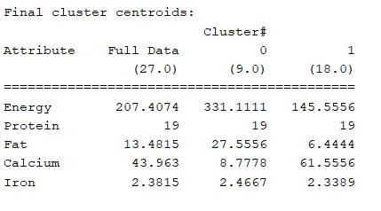

```{r setup, include=FALSE}
knitr::opts_chunk$set(echo = TRUE)
library(tidyr)
library(dplyr)
library(knitr)
set.seed(12345)
```

# 1. SimpleKmeans

*Apply "SimpleKMeans" to your data. In Weka euclidian distance is implemented in SimpleKmeans. You can set the number of clusters and seed of a random algorithm for generating initial cluster centers. Experiment with the algorithm as follows:*

## 1. 

*Choose a set of attributes for clustering and give a motivation. (Hint: always ignore attribute "name". Why does the name attribute need to be ignored?)*

Results Simple K Means, k = 2, seed = 1
<p>
{width=300px}
</p>


The attributes for the simpleKmeans clustering algorithm we choose are 2 clusters, with seed = 1. Two clusters is the minimum that we can choose, and it is a good start to see what happens if we simply want to divide the data into two groups. For the seed we started with 1, just so we can easily compare to other seeds. The output is depicted in the image.

The name attribute needs to be ignored because it is a string with labels, which is already a categorization of different groups.

## 2.

*Experiment with at least two different numbers of clusters, e.g. 2 and 5, but with the same seed value 10.*

Results Simple K Means, k = 2, seed = 10
<p>
{width=300px}
</p>

Results Simple K Means, k = 5, seed = 10
<p>
{width=300px}
</p>

## 3. 

*Then try with a different seed value, i.e. different initial cluster centers. Compare the results with the previous results. Explain what the seed value controls.*

Results Simple K Means, k = 2, seed = 11
<p>
{width=300px}
</p>


Results Simple K Means, k = 5, seed = 11
<p>
{width=300px}
</p>

The seed value controls for different initial centroids. Different initial centroids could lead to different clustering outcomes.

## 4.

*Do you think the clusters are "good" clusters? (Are all of its members "similar" to each other? Are members from different clusters dissimilar?)*

Comparing 2 clusters versus 5 clusters we find a number of differences. Since we only have 27 observations, 5 clusters is dividing the data into small groups. As can be seen in the outputs of k = 5, for both seeds, cluster 3 only contains 1 element. This cluster can thus be seen as an outlier and does not provide much information. Moreover, looking at the cluster centroids it often appears that some clusters share certain attributes, but then differ on others. For example, in the results of question 3, in the model with k = 5 and seed = 11, we see that clusters 3 and 4 share a very similar protein level, yet other attributes differ widely.

When looking at the results of the cluster models with k = 2, we notice that some attributes are less differentiating than others. In both models with k = 2, the protein levels are very similar in both clusters, thus not providing much information. The differentiation between the clusters is made when considering Fat, Calcium and the Energy levels, because the centroids differ more.

Results of k = 2, seed = 11; Energy of various foods

{width=450px}

Results of k = 2, seed = 11; Fat of various foods

{width=450px}

As we can see from the plot above, we can see that there are clear distinctions between two clusters (red and blue) using the attribute Energy and Fat. Both of them seem to make their own cluster. We can conclude that the clusters are relatively good.  


## 5. 

*What does each cluster represent? Choose one of the results. Make up labels (words or phrases in English) which characterize each cluster.*

As we look at the graph below, when can distinguish that the two clusters (red and blue) are foods with high energy levels, and low energy levels. The foods with high energy (red cluster) are mostly red meats, while the lower energy rich foods (blue cluster) are either non-red meats or more heavily processed (such as canned goods). So potential cluster names for cluster in red vs cluster in blue could be "red meat vs non-red meat", or "Energy rich foods vs Non-energy rich foods", or "non-processed foods vs processed foods".

Results of k = 2, seed = 11; Energy of various foods

{width=450px}


\newpage

# 2. MakeDensityBasedClusters

*Now with MakeDensityBasedClusters, SimpleKMeans is turned into a denstiy-based clusterer. You can set the minimum standard deviation for normal density calculation. Experiment with the algorithm as the follows:*

## 1. 

*Use the SimpleKMeans clusterer which gave the result you haven chosen in 5).*

Results Density Based Cluster, seed = 11, standard deviation = 1.0e-6

<p>
{width=300px}
</p>


Results Density Based Cluster, seed = 11, standard deviation = 1.0e-6
<p>
{width=450px}
</p>

## 2. 

*Experiment with at least two different standard deviations. Compare the results. (Hint: Increasing the standard deviation to higher values will make the differences in different runs more obvious and thus it will be easier to conclude what the parameter does)*


Results Density Based Cluster, seed = 11, standard deviation = 1
<p>
{width=300px}
</p>

Results Density Based Cluster, seed = 11, standard deviation = 1
<p>
{width=450px}
</p>

Results Density Based Cluster, seed = 11, standard deviation = 2
<p>
{width=300px}
</p>

Results Density Based Cluster, seed = 11, standard deviation = 2
<p>
{width=450px}
</p>


Results Density Based Cluster, seed = 11, standard deviation = 100
<p>
{width=300px}
</p>


Results Density Based Cluster, seed = 11, standard deviation = 100
<p>
{width=450px}
</p>

Although it is hard to determine exactly what the impact of the standard deviation is on the model, because we do not have access to the actual equations, we suspect that an increase in the standard deviation will correspond with more unequal clusters. In other words, from the graphs we obtained we see that one of the clusters covers more observations as the standard deviation increases. So as the standard deviation increases, the number of observations clustered into non-energy rich foods (blue cluster) increases too. We can see that using 1e-6 standard deviation there are 10 observations clustered into energy rich foods (red cluster) and 17 observations clustered into non-energy rich foods (blue cluster). Using 1 standard deviation we get 9 vs 18 and using 100 standard deviation we get 7 vs 20.  


